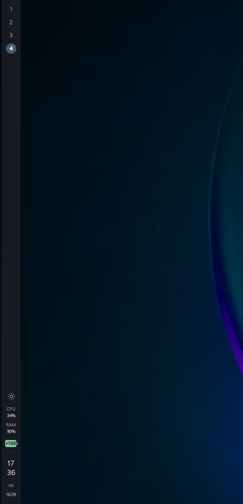

# Native Sidebar for GlazeWM

A vertical workspace bar for GlazeWM built to keep RAM usage low.

I built it to replace my Zebar setup, with reducing memory usage as the main goal.
It uses C++ and Win32, runs as a single native process and connects directly to
GlazeWM. There is no embedded browser or WebView runtime.

Click a workspace to switch to it. The clock and date sit at the bottom, with
optional CPU, RAM, battery and Windows theme controls above them.



## Memory usage

**From about 824 MB with my Zebar setup to 14 MB with Native Sidebar.**
Reducing that memory footprint was the reason I built this bar.

| Setup | Recorded working set |
| --- | ---: |
| Zebar with Overline, including its separate browser environment and core process | ~824 MB |
| Overline bar and its browser processes alone (part of the total above) | ~425 MB |
| Native Sidebar with widgets enabled | 14.07 MB |

The full Zebar setup used about 425 MB for Overline, 318 MB for its separate
browser environment and 81 MB for the core process, before opening settings.
Native Sidebar's recorded working set was **about 98% lower** than that total.
These are process working-set readings from one PC; Zebar's sum includes shared
memory, so the difference is not a measure of physical RAM freed. The Overline
setup also ran additional widgets, including weather, media and system-tray icons.

### Native Sidebar measurements

The following readings are from the 40-pixel development build.

| Recorded test | Working set (RAM) | Private committed memory |
| --- | ---: | ---: |
| Widgets disabled | 14.12 MB | 2.95 MB |
| Widgets enabled | 14.07 MB | 2.86 MB |
| After toggling Windows startup through the tray menu | 21.37 MB | 3.50 MB |

Recorded on Windows 11 x64 with one 96-DPI monitor. The widget samples lasted
15 seconds; the tray reading was taken after the startup-shortcut test.
Working set includes shared Windows libraries.

## Install

Requires Windows x64 and GlazeWM.

1. Install GlazeWM and run it once to create its configuration.
2. Download the installer ZIP from the [latest release](https://github.com/muc-martin/glazewm-sidebar/releases/latest).
3. Extract `native-sidebar-0.1.0-windows-x64.zip` and run **Install.cmd**.
   No administrator rights are needed.

The release also includes `native-sidebar.exe` for manual setups. The standalone
EXE runs the bar; use the installer ZIP for GlazeWM configuration and autostart.

The installer starts the sidebar and adds it to the Start menu, Windows Startup
and **Settings > Apps > Installed apps**. Files are installed in
`%LOCALAPPDATA%\Programs\NativeSidebar`.

### Changes to GlazeWM

Installation automatically configures GlazeWM to use the sidebar:

- Backs up the original configuration.
- Removes recognized Zebar and previous sidebar startup/shutdown commands.
- Adds a window-ignore rule and sets the outer gaps to 52 px left and 8 px top.
- Stops a running Zebar. Its files and widget settings stay installed.

Other commands, keybindings and settings are preserved. Disable any separate
Zebar autostart entry you have created to prevent both bars from starting.
GlazeWM integration is part of every installation; there is no opt-out setting.

For custom paths:

```powershell
.\Install.ps1 -GlazeExe 'C:\path\to\glazewm.exe' -ConfigPath 'C:\path\to\config.yaml'
```

The installer also reads `GLAZEWM_CONFIG_PATH`. It supports standard GlazeWM YAML
with inline or block command lists. Unsupported layouts, including YAML anchors,
are rejected before making changes. Workspace names can contain letters, digits,
underscores, periods and hyphens.

## Workspaces

The 40-pixel bar appears on the left of each monitor and shows only that monitor's
occupied workspaces and currently displayed workspace. The displayed workspace
is bold and highlighted on each screen. Workspace lists update when a workspace
moves between monitors.

A click switches to that workspace. Fullscreen windows hide the bar. If the
connection to GlazeWM drops, the bar shows `!` and reconnects automatically.

Workspace names are copied into `sidebar.ini` during installation. After changing
your GlazeWM workspace list, update this file and restart the sidebar.

## Widgets

Use the sidebar's notification-area icon to enable or disable widgets. All are
enabled by default, and your selections are saved between runs and updates.

| Widget | Function |
| --- | --- |
| Sun / moon | Switches Windows app and system themes. The sidebar keeps its dark background. |
| CPU | Busy processor time averaged over five seconds. |
| RAM | Physical memory usage, refreshed every five seconds. |
| Battery | Charge percentage inside the battery. Green fill and a lightning bolt mean a power adapter is connected, including at full charge. |

The battery updates every minute and when Windows reports a power change.
`--` indicates an unavailable reading; CPU also shows it during its first sample.

Widgets use native Windows APIs in the sidebar process. Disabled widgets stop
sampling. With CPU, RAM and battery disabled, the sampling timer stops entirely.

You can also edit `sidebar.ini` and restart the sidebar. Set a value to `0` to
disable that widget:

```ini
[widgets]
theme=1
cpu=1
ram=1
battery=1
```

## Startup and tray menu

Click the notification-area icon to show the sidebar, toggle **Start with Windows**
or exit. Menu labels are currently in German. If the icon is hidden, open the
notification area's overflow menu.

Launch **Native Sidebar** from the Start menu to open it again. At Windows sign-in,
the startup script starts GlazeWM if needed, starts the sidebar, then exits.

## Update or uninstall

To update, extract a new package and run **Install.cmd**. The installer preserves
widget settings and the original GlazeWM backup, and archives the previous install.

To uninstall, select **Native Sidebar > Uninstall** in Windows **Installed apps**.
This removes the startup and Start menu shortcuts, restores the original GlazeWM
configuration and starts Zebar if it was previously configured and is on PATH.
Installation files and backups remain on disk for recovery.

Updates and uninstallation stop if your GlazeWM configuration has changed since
installation. Reconcile those edits with `original-config.yaml` before proceeding.

## Limitations

- Windows 10 compatibility and multi-monitor/mixed-DPI behavior have not been tested.
- Workspace buttons that exceed the available screen height are not displayed.
- CPU reports busy time, which differs from Task Manager's frequency-adjusted metric.
  On systems with more than 64 logical processors, it covers the calling thread's
  processor group.

## Build

Requires CMake 3.24+, Visual Studio 2022 C++ desktop tools and a Windows SDK.

```powershell
cmake -S . -B build -A x64
cmake --build build --config Release
ctest --test-dir build -C Release --output-on-failure
powershell -NoProfile -ExecutionPolicy Bypass -File scripts/Package.ps1
```

The ZIP is written to `dist/`. Release builds statically link the C++ runtime;
the JSON parser is vendored in the repository.

GitHub Actions runs the build, tests and packaging on Windows. See
[testing](docs/TESTING.md) for the automated tests and desktop checks.

## License

[MIT](LICENSE). Dependencies are listed in [third-party notices](THIRD_PARTY_NOTICES.md).
